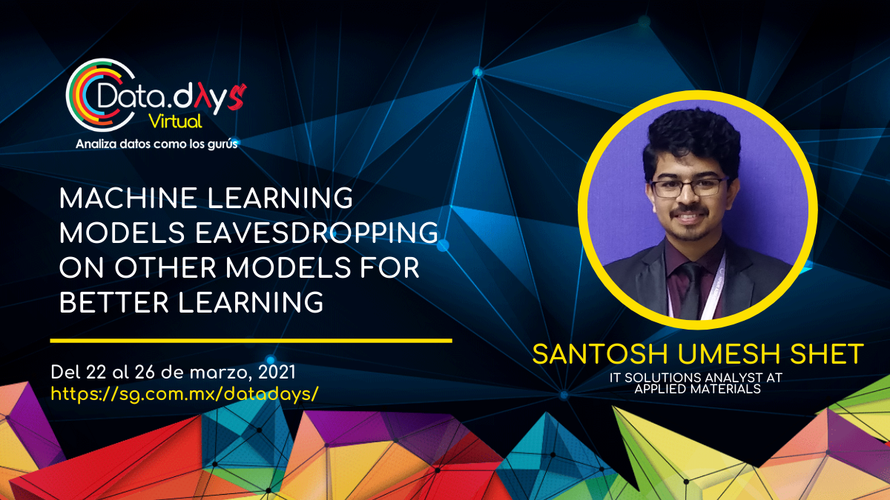
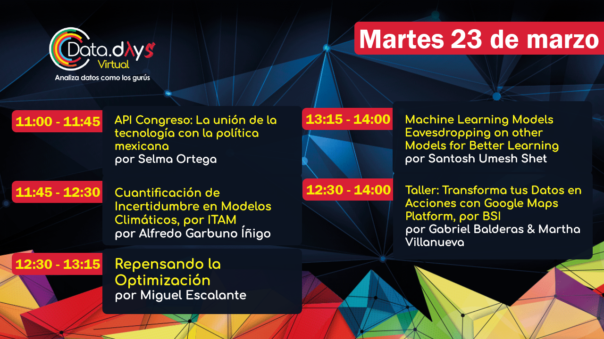

<link rel="stylesheet" href="https://maxcdn.bootstrapcdn.com/bootstrap/4.5.2/css/bootstrap.min.css">

  <ol class="carousel-indicators">
    <li data-target="#carouselExampleIndicators" data-slide-to="0" class="active"></li>
    <li data-target="#carouselExampleIndicators" data-slide-to="1"></li>
    <li data-target="#carouselExampleIndicators" data-slide-to="2"></li>
  </ol>
  

  

      
    

    

      
    

    

      
    

  

  <a class="carousel-control-prev" href="#carouselExampleIndicators" role="button" data-slide="prev">
    
    Previous
  </a>
  <a class="carousel-control-next" href="#carouselExampleIndicators" role="button" data-slide="next">
    
    Next
  </a>

 

Talk abstract:
Biologically speaking, we know different people interpret or understand certain concepts/topic differently or just that one person understands a concepts better than other. In such cases, we refer to other persons for better understanding. Different machine learning models also show varying accuracies for same task and dataset, which is indicative of how well a model had learned the features. One would argue that this is due to underlying architecture. Yes, this also means certain architectures are able to learn certain features better than the other similar to us, but how do we overcome this challenge? In this talk, we will explore how we can enable machine learning models to eavesdrop on other models for better learning during training. We will also try to make sense of how this approach came to be and how we can benefit from such techniques. Training such models sometimes becomes challenging, as these models require multiple hyper parameter setting or multiple dynamic learning rates depending on models ability to learn, multiple losses, and handle multiple datasets. A common term used to describe such models are Ensembling and Muti Task Modelling.

[Data Days 2021](https://sg.com.mx/datadays/sessions/2021/bt4-machine-learning-models-eavesdropping-on-other-models-for-better-learning/)
 
[Presentation link](https://docs.google.com/presentation/d/1kf01e21I_3CvfeOWhiwBjVt1Y5ET3Jtj356bhZVQfys/edit?usp=sharing)
